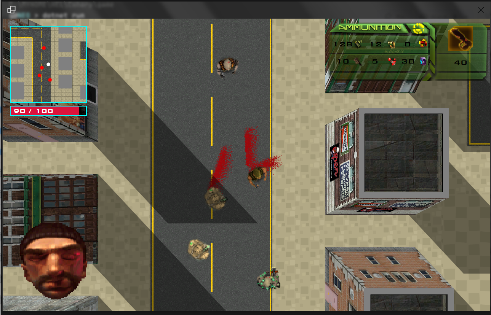

# 🕶️ Felony Fiesta


**Felony Fiesta** est un jeu d'action en vue de dessus (*top-down shooter*) rétro inspiré par **GTA 1**. Développé en **C#** avec **Windows Forms**, ce jeu a été réalisé comme projet final du cours de programmation événementielle.

---

## 🛠️ Spécifications Techniques

*   **Langage** : C# (.NET SDK)
*   **Interface Graphique** : Windows Forms (WinForms GDI+)
*   **Entrées Clavier** : Lecture bas niveau via l'API Win32 `GetAsyncKeyState` pour une réactivité maximale et éviter la latence d'événements WinForms standards.
*   **Audio** : Lecture native directe des fichiers `.wav` via l'API multimédia Windows (`winmm.dll`).

---

## 📦 Lancement du Jeu

### Prérequis

1.  Un système d'exploitation **Windows**.
2.  Le **SDK .NET** (version 6.0 ou supérieure recommandée).

### Exécution

Ouvrez une invite de commandes ou un terminal PowerShell à la racine du projet et lancez :

```bash
dotnet run
```

---

## 📂 Organisation du Code (Aperçu)

*   [Program.cs](file:///C:/MYHOME/HEL/Csharp/game/Program.cs) & [Form1.cs](file:///C:/MYHOME/HEL/Csharp/game/Form1.cs) : Point d'entrée et gestion des menus/interfaces UI WinForms.
*   [Game.cs](file:///C:/MYHOME/HEL/Csharp/game/Game.cs) : Initialisation générale et boucle de jeu (Game Loop).
*   [Player.cs](file:///C:/MYHOME/HEL/Csharp/game/Player.cs) : Gestion du joueur, de ses entrées clavier et de son inventaire.
*   [Enemy.cs](file:///C:/MYHOME/HEL/Csharp/game/Enemy.cs), [Thug.cs](file:///C:/MYHOME/HEL/Csharp/game/Thug.cs), [Merc.cs](file:///C:/MYHOME/HEL/Csharp/game/Merc.cs), [Doctor.cs](file:///C:/MYHOME/HEL/Csharp/game/Doctor.cs) : Comportements et IA des ennemis.
*   [Vehicle.cs](file:///C:/MYHOME/HEL/Csharp/game/Vehicle.cs) : Moteur physique simplifié pour la conduite des voitures.
*   [TurnManager.cs](file:///C:/MYHOME/HEL/Csharp/game/TurnManager.cs) : Système de gestion du combat tactique au tour par tour.
*   [NativeAudioPlayer.cs](file:///C:/MYHOME/HEL/Csharp/game/NativeAudioPlayer.cs) : Intégration bas niveau de l'audio via DLL Import.
*   [Draw.cs](file:///C:/MYHOME/HEL/Csharp/game/Draw.cs) : Moteur de rendu GDI+ custom.

---

*Développé avec passion pour le cours de programmation événementielle.* 🚗💨💥

