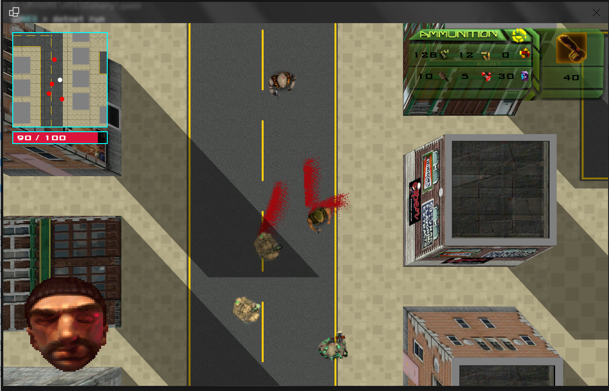

# 🕶️ Felony Fiesta


**Felony Fiesta** est un jeu d'action en vue de dessus (*top-down shooter*) rétro inspiré par **GTA 1**. 

*Note : Ce jeu a été originellement développé de zéro en utilisant **Windows Forms (GDI+)** car il s'agissait du projet final d'un cours de programmation événementielle. Il a par la suite été entièrement porté sur **Raylib** afin d'améliorer drastiquement ses performances et de profiter d'un rendu accéléré matériellement.*

---

## 🛠️ Spécifications Techniques

*   **Langage** : C# (.NET SDK)
*   **Moteur / Interface Graphique** : Raylib (via Raylib-cs)
*   **Entrées Clavier** : Gestion native via le moteur Raylib (remplace l'ancienne API Win32 `GetAsyncKeyState`)
*   **Audio** : Moteur audio natif de Raylib (remplace l'ancienne utilisation de `winmm.dll`)

---

## 📦 Lancement du Jeu

### Prérequis

1.  Un système d'exploitation **Windows**, **macOS** ou **Linux**.
2.  Le **SDK .NET** (version 9.0 ou supérieure recommandée).

### Exécution

Ouvrez une invite de commandes ou un terminal à la racine du projet et lancez :

```bash
dotnet run
```

---

## 📂 Organisation du Code (Aperçu)

*   [Program.cs](file:///C:/MYHOME/HEL/Z.Deuxième_Année/Csharp/game/Program.cs) & [Game.cs](file:///C:/MYHOME/HEL/Z.Deuxième_Année/Csharp/game/Game.cs) : Point d'entrée, initialisation de Raylib et boucle de jeu (Game Loop).
*   [Form1.cs](file:///C:/MYHOME/HEL/Z.Deuxième_Année/Csharp/game/Form1.cs) : Ancien conteneur WinForms, désormais utilisé comme gestionnaire de menus (UI mode immédiat).
*   [Player.cs](file:///C:/MYHOME/HEL/Z.Deuxième_Année/Csharp/game/Player.cs) : Gestion du joueur, de ses entrées clavier et de son inventaire.
*   [Enemy.cs](file:///C:/MYHOME/HEL/Z.Deuxième_Année/Csharp/game/Enemy.cs), [Thug.cs](file:///C:/MYHOME/HEL/Z.Deuxième_Année/Csharp/game/Thug.cs), [Merc.cs](file:///C:/MYHOME/HEL/Z.Deuxième_Année/Csharp/game/Merc.cs), [Doctor.cs](file:///C:/MYHOME/HEL/Z.Deuxième_Année/Csharp/game/Doctor.cs) : Comportements et IA des ennemis.
*   [Vehicle.cs](file:///C:/MYHOME/HEL/Z.Deuxième_Année/Csharp/game/Vehicle.cs) : Moteur physique simplifié pour la conduite des voitures.
*   [TurnManager.cs](file:///C:/MYHOME/HEL/Z.Deuxième_Année/Csharp/game/TurnManager.cs) : Système de gestion du combat tactique au tour par tour.
*   [Draw.cs](file:///C:/MYHOME/HEL/Z.Deuxième_Année/Csharp/game/Draw.cs) : Moteur de rendu Raylib (inclut le système de projection pseudo-3D pour les bâtiments).
*   [Map.cs](file:///C:/MYHOME/HEL/Z.Deuxième_Année/Csharp/game/Map.cs) : Gestion du système de tuiles (Tilemap) et génération du terrain.

---

*Développé avec passion.* 🚗💨💥
